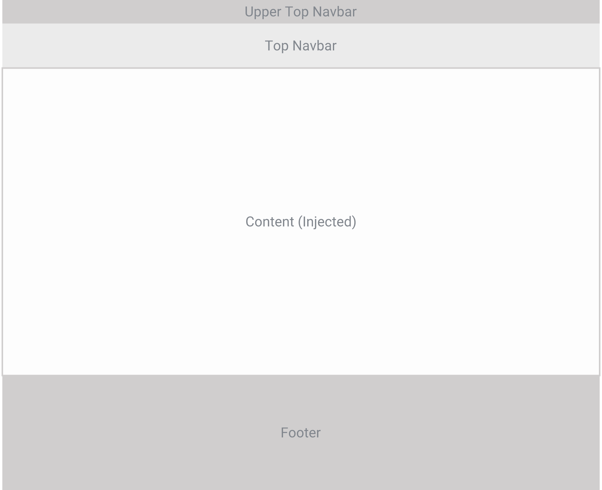
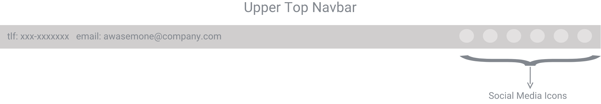
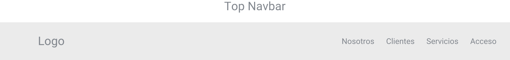
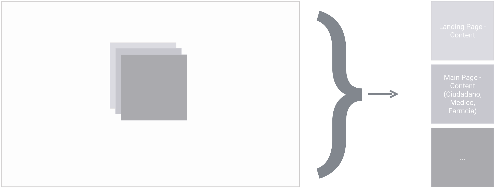

# Base Layout

[[toc]]

## Upper Top Navbar

Parte superior de la aplicación mostrara información de contacto y en enlaces relacionados a las redes sociales de la plataforma.

## Top Navbar

Barra Superior de navegación que contendrá el logo de la plataforma asi como algunos botones relacionados a la navegación interna o relativa dentro de la plataforma

::: tip
**_Nota_**: _los botones en la parte superior derecha pueden cambiar según el contexto de la aplicación_
:::

## Content (Injected)

En este contenedor es donde se realizara la inyección de contenido de cada vista o componente en la plataforma, siendo el único elemento que cambiara según el contexto de la aplicación.

## Footer

Parte inferior de la aplicación, en ella se va mostrar la información relacionada a la empresa, asi como otros enlaces disponibles sobre la misma y de igual forma las redes sociales relacionadas a la aplicación.

