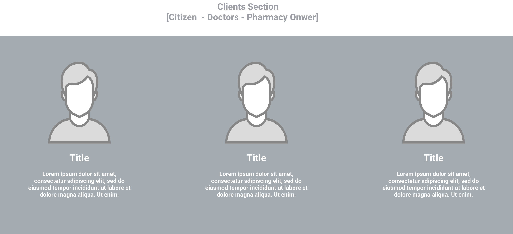
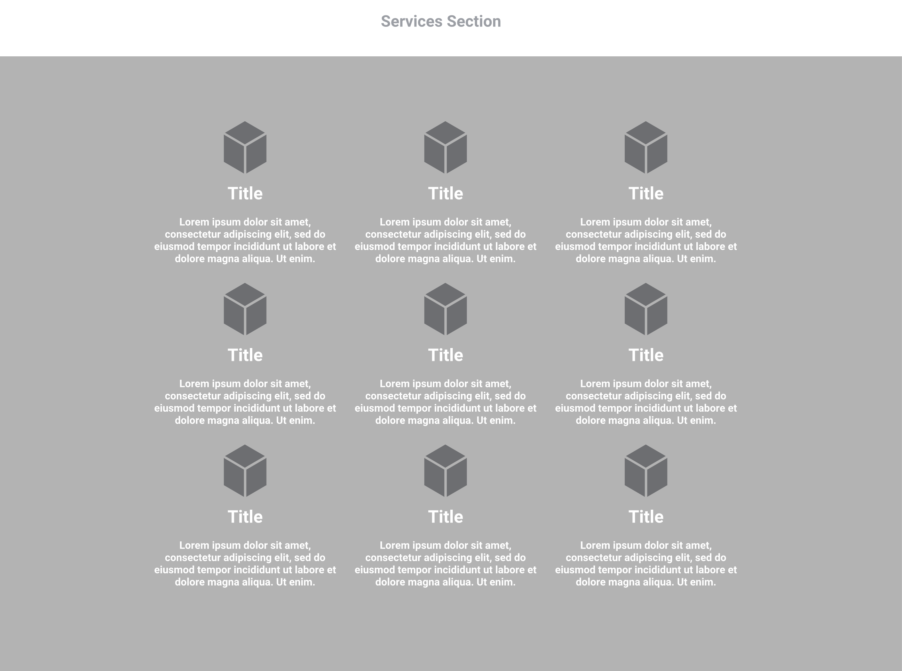

# Landing Page

Esta seria la primera vista de cara al usuario en la cual se muestra en forma de infografia la información de nuestra plataforma, esta pagina siempre es dedicada al marketing del producto y como portafolio de muestra de los servicios que ofrece la plataforma.

[[toc]]

## Upper Section

Esta seccion pude servir como demo de uno de los servicios de la plataforma dado que se puede ofrecer al usuario la capacidad de realizar la consulta de un producto en especifico y a su vez su localizacion en el mapa de este componente, o tambien puede servir como rapidad de imagenes orientadas al marketing que interactuan en un carrusel.

## About Section

Este bloque mostrara informacion de la empresa y su mensaje cara al publico, contenido acerca de la mision vision.

## Client's Section

Mostrara informacion de los clientes que usaran la plataforma.

## Services Section

Informacion de los servicios de nuestra plataforma.

